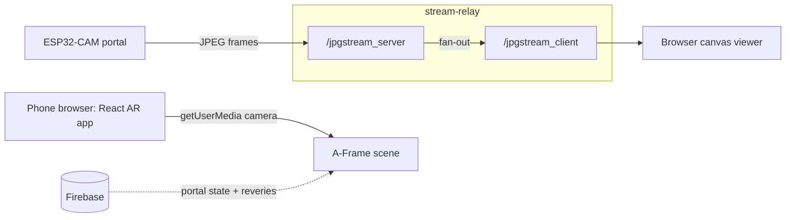

# UniverCity

Connect college campuses worldwide through a "phygital" portal.

I built this in 2023 as a way to make distance between campuses feel physical instead of abstract. A small ESP32-CAM device (the "portal") sits in a real place and streams its camera over the network. On the other end, a React AR web app turns that shared space into somewhere students can leave messages and meet across locations. The portal is the object you walk up to; the web app is the layer of content that lights up when it opens.

## What it does

- Streams live JPEG frames from an ESP32-CAM portal device to any browser viewer
- Runs an AR web app on the phone that overlays student posts ("reveries") in space
- Reads the portal's open/closed state from Firebase, so content only appears when the portal is live
- Serves a standalone canvas viewer for the raw portal feed

## How it works

The project is two pieces: a Node WebSocket relay that carries the camera feed, and a React AR web app that renders the social layer.



### The camera relay

The interesting part is the relay in `stream-relay/app.js`. It runs two separate `WebSocket.Server` instances in `noServer` mode and routes each incoming connection by URL path on the HTTP upgrade event: `/jpgstream_server` for the ESP32 camera producing frames, `/jpgstream_client` for browsers consuming them. Every binary JPEG that arrives on the producer socket is forwarded, untouched, to all open consumer sockets. There is no transcoding and no buffering, so latency stays low and the relay is completely stateless. The tradeoff is bandwidth: each frame is a full JPEG, so cost scales with resolution and frame rate rather than with motion.

### The browser viewer

On the receiving end (`stream-relay/public` served through an EJS page), the browser takes each WebSocket message, wraps `message.data` in a `Blob` object URL with `URL.createObjectURL`, and draws it to a `<canvas>` as soon as the image loads. It is MJPEG over WebSocket, done with a few lines and no player library.

### The AR web layer

The React app in `frontend/` is a separate surface. Its `ARDisplay` component pulls the phone's own rear camera through `getUserMedia` and uses it as a live background, then mounts an A-Frame `<Scene>` on top. Student posts come from Firebase, get loaded as textures, and are laid out as `a-plane` entities in a grid facing the viewer. All of it is gated on `portalOpen`, a boolean the app subscribes to from Firebase, so the physical portal opening in the real world is what switches the AR content on.

## Tech stack

- Frontend: React 18, A-Frame, aframe-react, three.js, react-three-fiber, Google Maps JS API
- Relay: Node, Express, `ws`, EJS
- Data: Firebase (portal state and posts)
- Hardware: ESP32-CAM streaming JPEG frames over WebSocket

## Repo layout

```
univercity/
  frontend/       React AR web app (Create React App)
  stream-relay/   Node/WebSocket relay + canvas viewer (formerly portal_backend2)
```

This repo consolidates the original `univercity` frontend and its `portal_backend2` relay into one place, with history preserved.

## Running it

```bash
# relay (serves the viewer and bridges the camera)
cd stream-relay
npm install
npm start            # http://localhost:3000

# frontend
cd frontend
npm install
npm start            # http://localhost:3000 (run one at a time or change ports)
```

The frontend needs a Google Maps API key set as an environment variable before it will load the map. Do not commit it. The original `frontend/.env` shipped with a Maps key committed by mistake; if you are reusing this code, rotate that key in Google Cloud, since it stays in git history.

## Status

2023 prototype. The camera relay works end to end; the AR web layer is an early experiment built alongside my other location-based AR work from that year.
