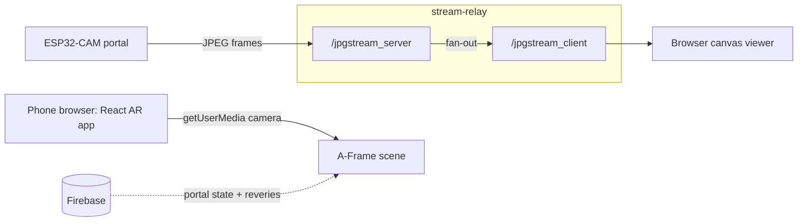
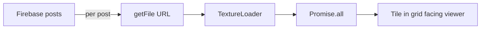

# UniverCity

Connect college campuses worldwide through a "phygital" portal.

I built this in 2023. The idea was simple. Put a small camera device (the "portal") in a real place, and let students somewhere else walk up to a version of that place in AR. A React web app turns the shared space into somewhere you can leave a message and cross paths with people from another campus. The portal is the object you approach. The web app is the content that lights up when it opens.

## What it does

- Streams live JPEG frames from an ESP32-CAM portal device to any browser viewer
- Runs an AR web app on the phone that overlays student posts ("reveries") in space
- Reads the portal's open/closed state from Firebase, so content only appears when the portal is live
- Serves a standalone canvas viewer for the raw portal feed

## How it works

Two pieces do the work: a Node WebSocket relay that carries the camera feed, and a React AR web app that renders the social layer.



### The camera relay

The relay is the piece I like most, and it lives in `stream-relay/app.js`. It spins up two separate `WebSocket.Server` instances in `noServer` mode. Each incoming connection is routed by URL path on the HTTP upgrade event. `/jpgstream_server` is the ESP32 producing frames. `/jpgstream_client` is a browser consuming them. Every JPEG that lands on the producer socket gets forwarded, untouched, to all open consumer sockets. Because it only forwards bytes and never transcodes or buffers, latency stays low and the relay holds no state. Each frame ships as a full JPEG, so bandwidth climbs with resolution and frame rate.

### The browser viewer

On the receiving end, the browser does almost nothing. It takes each WebSocket message, wraps `message.data` in a `Blob` object URL, and paints it to a `<canvas>` as the image loads. That is MJPEG over WebSocket, in a handful of lines, with no player library.

### The AR web layer

The React app in `frontend/` is its own surface. `ARDisplay` grabs the phone's rear camera through `getUserMedia` and uses it as a live background. Then it mounts an A-Frame `<Scene>` on top. Student posts come from Firebase and become the content in that scene. All of it hangs on one boolean, `portalOpen`, that the app watches in real time. So when the physical portal opens in the real world, the AR content switches on.

## Placing the reveries

Before anything renders, `ARDisplay` prefetches every reverie. It walks the Firebase posts, pulls each image through `getFile`, and loads it with a THREE `TextureLoader`. A `Promise.all` waits for the whole set, so nothing pops in half-loaded. The planes then tile three to a row in front of you, and each one carries `look-at="[0 0 0]"` so it turns to face the viewer wherever it lands.



## Tech stack

- Frontend: React 18, A-Frame, aframe-react, three.js, react-three-fiber, Google Maps JS API
- Relay: Node, Express, `ws`, EJS
- Data: Firebase (portal state and posts)
- Hardware: ESP32-CAM streaming JPEG frames over WebSocket

## Repo layout

```
univercity/
  frontend/       React AR web app (Create React App)
  stream-relay/   Node/WebSocket relay + canvas viewer
```

## Running it

```bash
# relay (serves the viewer and bridges the camera)
cd stream-relay
npm install
npm start            # http://localhost:3000

# frontend
cd frontend
npm install
npm start            # http://localhost:3000 (run one at a time or change ports)
```

The frontend reads a Google Maps API key from an environment variable to load the map. Use your own key and keep it out of source control.

## Status

2023 prototype. The camera relay works end to end. The AR web layer is an early experiment from the same year I spent building location-based AR.
